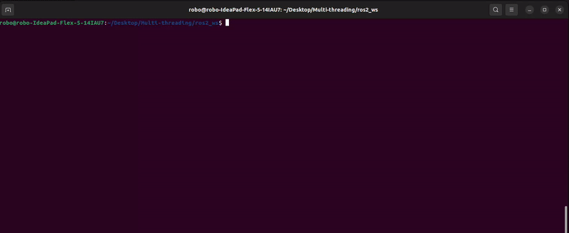

# Example of a Single and Multi Thread in ROS2 (Humble)
> This  repository have the objective to see the diference between Single-Thread and Multi-Thread.
> 
<p align="center">
  
</p>

## Prerequisites
* [ROS2-Humble](https://docs.ros.org/en/humble/index.html#)

## Installation

Mac OS X & Linux & Windows:

```sh 
git clone https://github.com/LucasLagoeiro/Project-CCP130.git
```

After this you just need to compile in the workspace:
```sh
cd ros2_ws && colcon build
```
And run the code.


## Run the code
This for Single-Thread:
```sh
ros2 run executors_exercises_pkg single-thread-executor_example_3_node 
```

And this for Multi-Thread:
```sh
ros2 run executors_exercises_pkg multi-thread-executor_example_3_node 
```

## Diference Between Single-Thread and Multi-Thread
> When you run both codes, you can barely see the difference between this two methods of Threads.
<p align="center">
    <u><b>Single-Thread</b></u>
</p>

<p align="center">
   
</p>

<p align="center">
  <u><b>Multi-Thread </b></u> 
</p>

<p align="center">
  
</p>


## Updates


* 1.0.0
    * Workspace with one example of single-thread and multi-thread.


## Meta
The ideia of this repository is to help people to develop projects in ROS2.

Lucas Lagoeiro - [@DevLagoeiro](https://twitter.com/DevLagoeiro) - devlagoeiro@outlook.com

[https://github.com/LucasLagoeiro](https://github.com/LucasLagoeiro)
